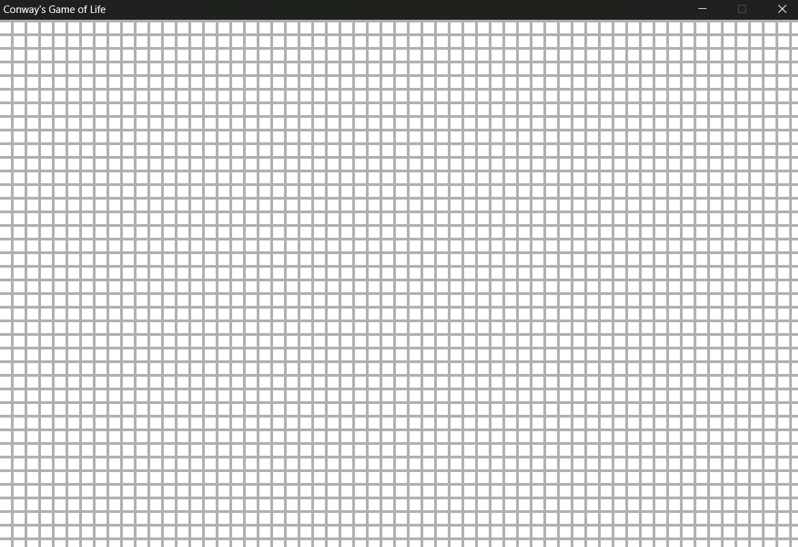

# Day 1 — 60 Days of Learning
**Date:** 2025/06/01  

## Today I

- set up SDL3 in C
- created a window using SDL
- drew a grid using rects to represent cells
- wrote basic rendering logic for the grid layout

## I Learned

- how to initialize a SDL window and its surface in C
- how to draw rectangles using `SDL_FillSurfaceRect`
- creating a basic game loop using while loop & with event polling
- grids.

