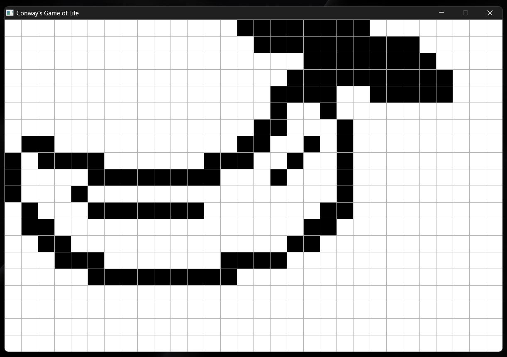

# Day 3 — 60 Days of Learning
**Date:** 2025/06/03

## Today I

- implemented the fucntion to populate the cells (i.e. to make cells alive)
- implemented resetting of the grid

## I Learned

- how to use mouse button events in SDL3
- how to handle mouse and key inputs on a lower level
- drawing.

